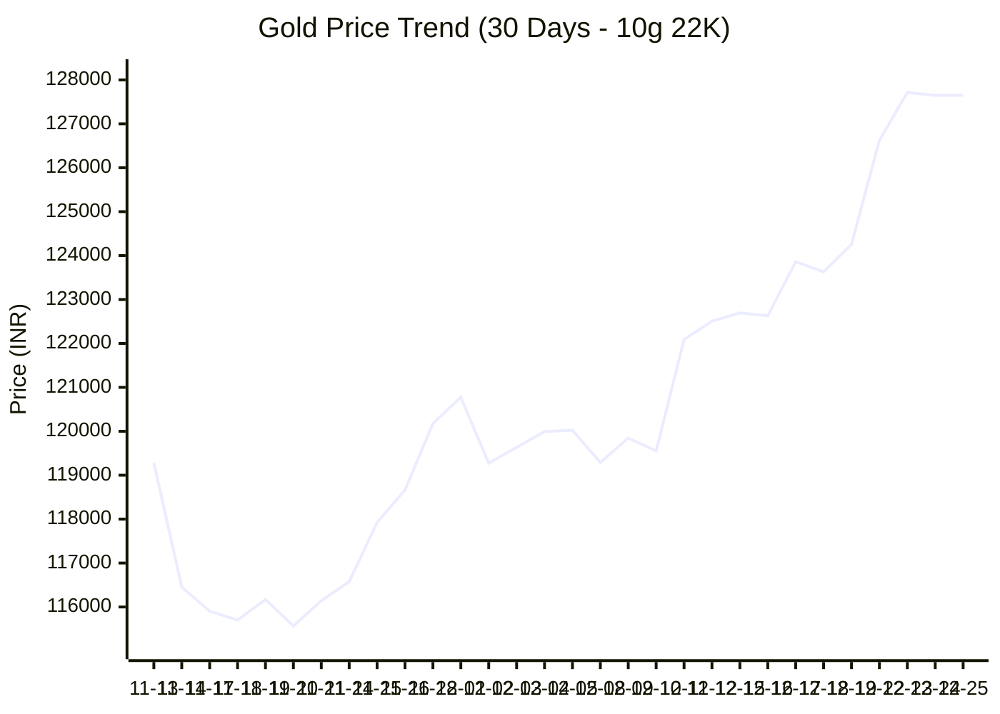

# 🏆 Aurum-V1: Autonomous Gold Intelligence

> **"A robust, self-correcting ETL pipeline that tracks, predicts, and analyzes the Indian Gold Market using Machine Learning and NLP."**

### ⚡ Live Market Intelligence
| Metric | Status | Value | Description |
| :--- | :--- | :--- | :--- |
| **Price (10g)** | 🟢 | **₹127,650** | Standard Jewellery Unit (22K) |
| **Price (1g)** | 🔹 | **₹12,765** | Per Gram Unit |
| **Forecast** | 🔮 | **₹128,191** | Predicted price for tomorrow |
| **Momentum** | 📉 | **RSI 86.73** | 0-30=Cheap, 70-100=Expensive |
| **Mood** | 🌍 | **RISK-ON (High Demand)** | Analysis of Global News Feeds |

---

### 📈 Price Action (Last 30 Days)

---

### 🧠 The Oracle's Report
* **Technical Analysis:** The market is currently **BULLISH (Up Trend) 🟢**. The RSI is **86.73**.
    * *What this means:* The price is rising aggressively. Be cautious of a sudden drop.
* **Fundamental Analysis:** Our Sentinel Bot scanned global news and detected a **RISK-ON (High Demand)** environment (Score: 0.43).
    * *Top Headline:* "Gold Price Surges Rs 2,650 To Record Rs 1.4 Lakh Per 10 Gram - NDTV"

---

### 📚 How to Read This Dashboard
**1. What is RSI (Relative Strength Index)?**
Think of RSI as a speedometer for the price (0 to 100).
* **> 70 (Overbought):** The price went up too fast. It usually crashes soon after.
* **< 30 (Oversold):** The price dropped too fast. It usually bounces back up.

**2. Why Analyze News Sentiment?**
Gold is a "Fear Asset." 
* When the world is **scared** (War, Pandemic, Recession), people buy Gold -> **Price Goes UP.**
* When the world is **happy** (Peace, Strong Economy), people sell Gold -> **Price Goes DOWN.**
* *Our Sentinel Bot reads the news to see if the world is scared or happy.*

**3. What is Bullish vs. Bearish?**
* **🟢 Bullish:** The trend is UP (Like a Bull attacking with horns up).
* **🔴 Bearish:** The trend is DOWN (Like a Bear swiping with paws down).

---

### 🏗️ Technical Architecture
* **Ingestion:** Custom `curl_cffi` driver (mimics Chrome 120) to bypass WAFs.
* **Storage:** Atomic CSV ledger to prevent data corruption.
* **Prediction:** Holt-Winters Exponential Smoothing (Statistical ML).
* **Context:** VADER Sentiment Analysis on Google News RSS feeds.

---
*Last Updated: 2025-12-25 15:00:57 IST | Automated by GitHub Actions*
