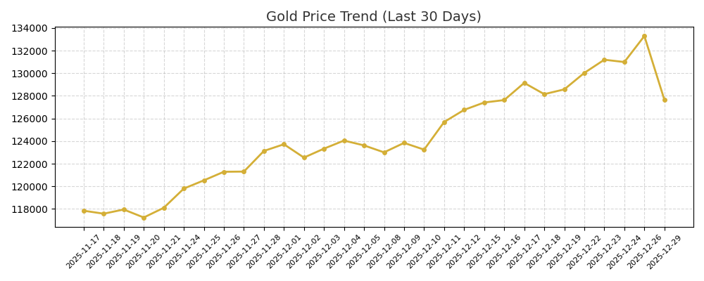

# 🔱 Aurum-V1: Market Command Center

> **"Professional Intelligence for the Indian Gold Market."** > *Engine: Random Forest Regressor (Multivariate) | Signals: USD/INR, News, RSI.*

| 🏛️ Metric | 💰 10 Grams (Standard) | 💎 1 Gram (Retail) | 📉 Status |
| :--- | :---: | :---: | :---: |
| **Current Price** | **₹127,649** | **₹12,764** | BULLISH 🟢 |
| **Tomorrow's Forecast** | `₹129,706` | `₹12,970` | Stable 🌊 |
| **Change (vs Yest)** | 🔻 ₹5,648 | 🔻 ₹565 | RSI: 61.89 |

---

### 📊 Market Trend Analysis
*Visualizing the price action over the last 30 days.*

---

### ⏳ The Time Machine: Accuracy & Trend
*Comparing the Past, Present, and Future for both Standard (10g) and Retail (1g) units.*

| Timeline | Price (10g) | Price (1g) | Change (10g) | Change (1g) | Insight |
| :--- | :---: | :---: | :---: | :---: | :--- |
| **Yesterday** | ₹133,297 | ₹13,329 | - | - | Historical Anchor |
| **Today** | **₹127,649** | **₹12,764** | 🔻 ₹5,648 | 🔻 ₹565 | **Actual Market Rate** |
| **Tomorrow** | `₹129,706` | `₹12,970` | 🔺 ₹2,057 | 🔺 ₹206 | *Stable 🌊* |

> **🎯 AI Accuracy Tracker:** > Yesterday's prediction error was **N/A (Calibrating)**.  
> *The model learns from this error to improve future forecasts.*

---

### 🧠 The Oracle's Report
* **Prediction:** The model expects prices to move **🔺 ₹2,057 (10g)** / **₹206 (1g)** tomorrow.
* **Confidence Check:** Market volatility is **Stable 🌊**. RSI is at **61.89**.
* **Key Drivers:** Predictions are now weighted by **USD/INR Exchange Rates** and **Global News Sentiment**.

---

### 📰 Sentinel Intelligence
* **Market Mood:** **NEUTRAL** (Score: 0.35)
* **Key Headlines:**
* *No significant market news detected today.*

---
*Last Updated: 2025-12-30 00:21:26 IST*