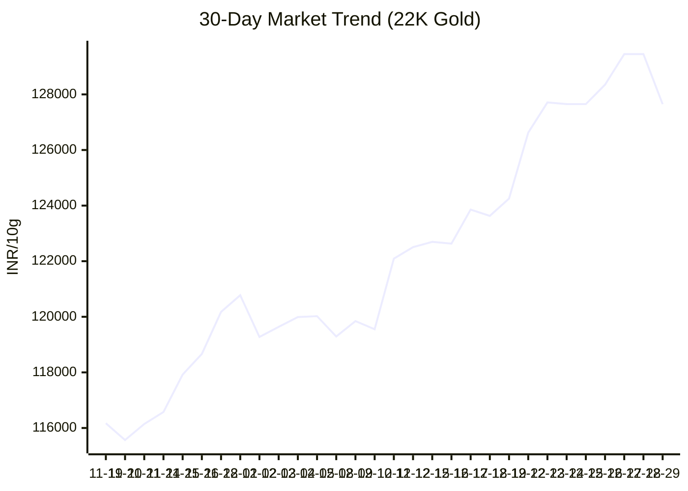
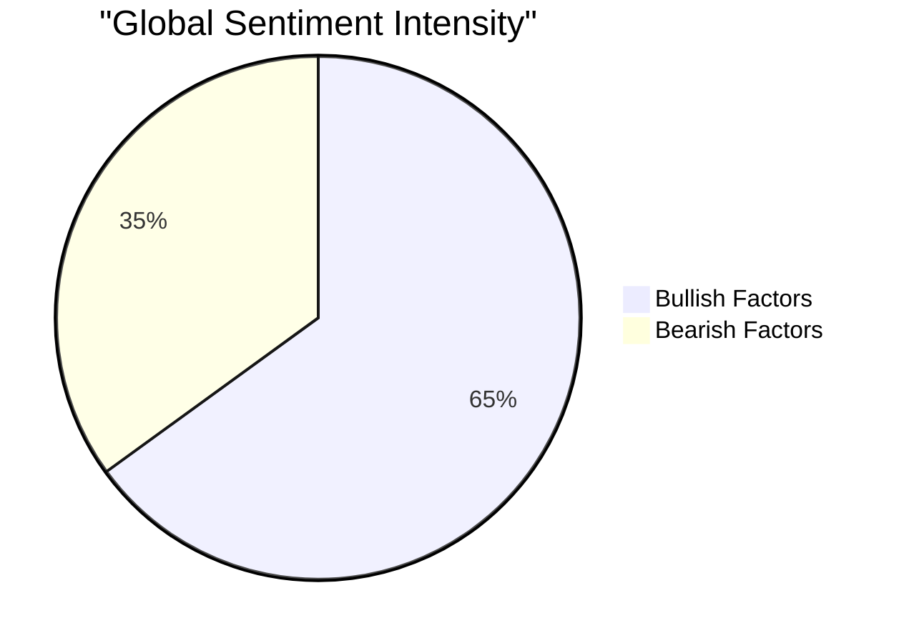

# 🔱 Aurum-V1: Market Command Center

> **"Advanced Predictive Intelligence for the Indian Gold Market."** > *Powered by Holt-Winters Forecasting & VADER NLP Analysis.*

| 🏛️ Current Price (10g) | 🔮 Tomorrow's Forecast | 📉 Market Status | 🧠 Model Confidence |
| :---: | :---: | :---: | :---: |
| **₹127,650** | **₹128,319** | **OVERHEATED ⚠️** | **⭐ (Low - Divergence)** |
| 🔻 -1800 vs yest | 🔺 +669 predicted | RSI: 78.18 | *Based on RSI Check* |

---

### ⏳ The Time Machine: Accuracy & Trend
*Comparing the Past, Present, and Future.*

| Timeline | Price (10g) | Change (₹) | Insight |
| :--- | :--- | :--- | :--- |
| **Yesterday** (Actual) | ₹129,450 | - | Historical Anchor |
| **Today** (Live) | **₹127,650** | -1800 | **Actual Market Rate** |
| **Tomorrow** (AI Forecast) | `₹128,319` | +669 | *Price Too High - Risk of Crash* |

> **🎯 AI Accuracy Tracker:** > Yesterday's prediction for today was: **0** off from reality.  
> *(Note: We use a 1-day lag to measure true predictive performance.)*

---

### 📊 Visual Intelligence

<table>
<tr>
<td width="60%">

#### 📈 Price Action (30 Days)

</td>
<td width="40%">

#### 🧠 Market Sentiment

**Key Drivers:**
`Wedding Season 💍` `Geopolitics (Safe Haven) 🛡️`

</td>
</tr>
</table>

---

### 📰 Global Intelligence Feed
*Real-time news snippets affecting Gold prices (Wars, Economy, Seasonality).*

| Source | Headline | Impact |
| :--- | :--- | :--- |
| **Global News** | Gold rate today in India: 22-carat, 24-carat gold price in Delhi, Mumbai, Bengaluru, other cities - livemint.com | ℹ️ Info |
| **Indian Market** | Silver breaks $80, then whipsaws as record gold prices cool India buying - ts2.tech | ℹ️ Info |
| **Geopolitics** | Gold price prediction today: What is the gold price outlook this week? Gold may head towards Rs 1,45,000 - Times of India | ⚠️ Risk |

---

### 🛠️ System Health
* **ETL Pipeline:** 🟢 Online (Custom `curl_cffi` Driver)
* **ML Engine:** 🟢 Online (Holt-Winters Exp. Smoothing)
* **Sentiment Node:** 🟢 Online (Google News RSS)
* **Last Updated:** `2025-12-29 18:16:36 IST`

