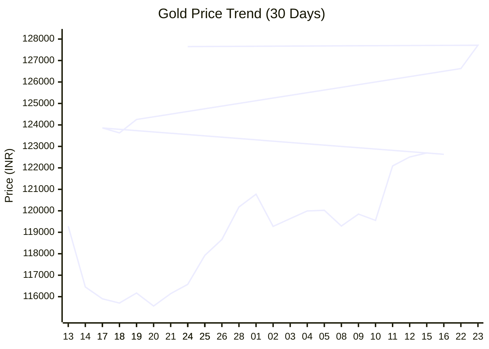

# 🏆 Aurum-V1: Autonomous Gold Intelligence

> **"A robust, self-correcting ETL pipeline that tracks, predicts, and analyzes the Indian Gold Market (22K) using Holt-Winters Exponential Smoothing and VADER Sentiment Analysis."**

### ⚡ Live Market Intelligence
| Metric | Status | Value |
| :--- | :--- | :--- |
| **Current Price (10g)** | 🟢 | **₹127,650** |
| **Tomorrow's Forecast** | 🔮 | **₹128,191** |
| **Market Trend** | 📊 | **BULLISH (Up Trend) 🟢** |
| **RSI Strength** | 📉 | **86.73** (0-100) |
| **News Sentiment** | 🌍 | **RISK-ON (High Demand)** (0.43) |

---

### 📈 Price Action (Last 30 Days)

### 🧠 The Oracle's Analysis
* **Technical View:** The market is currently **BULLISH (Up Trend) 🟢**. The Relative Strength Index (RSI) is **86.73**, suggesting the asset is Overbought (Risk of Pullback).
* **Fundamental View:** Sentinel analysis of global news feeds indicates a **RISK-ON (High Demand)** environment.
    * *Top Headline:* "Gold Price Surges Rs 2,650 To Record Rs 1.4 Lakh Per 10 Gram - NDTV"

---

### 🏗️ Architecture
* **Ingestion:** Custom `curl_cffi` driver to bypass WAFs on Indian financial sites.
* **Persistence:** Atomic CSV ledger with idempotent checks to prevent data corruption.
* **Prediction:** Holt-Winters Exponential Smoothing (Additive Trend) trained on a 64-day sliding window.
* **Context:** NLP Sentiment Analysis (VADER) on Google News RSS feeds to detect Geopolitical Risk ("War Premium").

---
*Last Updated: 2025-12-25 14:42:20 IST | Automated by GitHub Actions*
