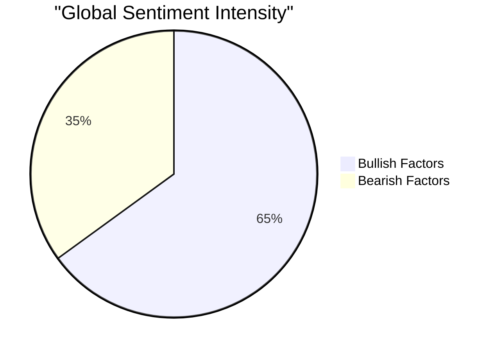

# 🔱 Aurum-V1: Market Command Center

> **"Advanced Predictive Intelligence for the Indian Gold Market."** > *Powered by Holt-Winters Forecasting & VADER NLP Analysis.*

<<<<<<< HEAD
<div align="center">

| 🏛️ Current Price (10g) | 🔮 Tomorrow's Forecast | 📉 Market Momentum | 🌍 Global Mood |
| :---: | :---: | :---: | :---: |
| **₹127,650** | **₹128,159** | **BULLISH 🟢** | **RISK-ON (High Demand)** |
| 🔻 -700 vs yest | 🔺 +509 predicted | RSI: 87.18 | Score: 0.3 |

</div>
=======
### ⚡ Live Market Intelligence
| Metric | Status | Value | Description |
| :--- | :--- | :--- | :--- |
| **Price (10g)** | 🟢 | **₹129,450** | Standard Jewellery Unit (22K) |
| **Price (1g)** | 🔹 | **₹12,945** | Per Gram Unit |
| **Forecast** | 🔮 | **₹129,834** | Predicted price for tomorrow |
| **Momentum** | 📉 | **RSI 96.67** | 0-30=Cheap, 70-100=Expensive |
| **Mood** | 🌍 | **RISK-ON (High Demand)** | Analysis of Global News Feeds |
>>>>>>> 6b7ee687e18459a8f44f60b7f49228901ae50870

---

### ⏳ The Time Machine: Accuracy & Trend
*Comparing the Past, Present, and Future.*

| Timeline | Price (10g) | Change (₹) | Insight |
| :--- | :--- | :--- | :--- |
| **Yesterday** (Actual) | ₹128,350 | - | Historical Anchor |
| **Today** (Live) | **₹127,650** | -700 | **Actual Market Rate** |
| **Tomorrow** (AI Forecast) | `₹128,159` | +509 | *Volatility: High ⚡* |

> **🎯 AI Accuracy Tracker:** > The model's prediction for today deviated by **0 INR** from the actual price.  
> *(Note: This metric refines automatically over time as the Feedback Loop gathers data.)*

---

### 📊 Visual Intelligence

<table>
<tr>
<td width="60%">

#### 📈 Price Action (30 Days)
```mermaid
xychart-beta
<<<<<<< HEAD
    title "30-Day Market Trend (22K Gold)"
    x-axis [ 11-17, 11-18, 11-19, 11-20, 11-21, 11-24, 11-25, 11-26, 11-28, 12-01, 12-02, 12-03, 12-04, 12-05, 12-08, 12-09, 12-10, 12-11, 12-12, 12-15, 12-16, 12-17, 12-18, 12-19, 12-22, 12-23, 12-24, 12-25, 12-26, 12-29 ]
    y-axis "INR/10g" 115367 --> 128550
    line [115903, 115704, 116171, 115567, 116143, 116576, 117923, 118664, 120177, 120775, 119274, 119635, 119992, 120023, 119291, 119846, 119553, 122091, 122507, 122695, 122632, 123858, 123630, 124254, 126624, 127712, 127650, 127650, 128350, 127650]
=======
    title "Gold Price Trend (30 Days - 10g 22K)"
    x-axis [ 11-18, 11-19, 11-20, 11-21, 11-24, 11-25, 11-26, 11-28, 12-01, 12-02, 12-03, 12-04, 12-05, 12-08, 12-09, 12-10, 12-11, 12-12, 12-15, 12-16, 12-17, 12-18, 12-19, 12-22, 12-23, 12-24, 12-25, 12-26, 12-27, 12-28 ]
    y-axis "Price (INR)" 115067 --> 129950
    line [115704, 116171, 115567, 116143, 116576, 117923, 118664, 120177, 120775, 119274, 119635, 119992, 120023, 119291, 119846, 119553, 122091, 122507, 122695, 122632, 123858, 123630, 124254, 126624, 127712, 127650, 127650, 128350, 129450, 129450]
>>>>>>> 6b7ee687e18459a8f44f60b7f49228901ae50870
```

</td>
<td width="40%">

<<<<<<< HEAD
#### 🧠 Market Sentiment


**Key Drivers:**
`Geopolitics (Safe Haven) 🛡️` `Wedding Season 💍`

</td>
</tr>
</table>
=======
### 🧠 The Oracle's Report
* **Technical Analysis:** The market is currently **BULLISH (Up Trend) 🟢**. The RSI is **96.67**.
    * *What this means:* The price is rising aggressively. Be cautious of a sudden drop.
* **Fundamental Analysis:** Our Sentinel Bot scanned global news and detected a **RISK-ON (High Demand)** environment (Score: 0.35).
    * *Top Headline:* "Gold rate today in India: 22-carat, 24-carat gold price in Delhi, Mumbai, Bengaluru, other cities - livemint.com"
>>>>>>> 6b7ee687e18459a8f44f60b7f49228901ae50870

---

### 📰 Global Intelligence Feed
*Real-time news snippets affecting Gold prices (Wars, Economy, Seasonality).*

| Source | Headline | Impact |
| :--- | :--- | :--- |
| **Global News** | Gold rate today in India: 22-carat, 24-carat gold price in Delhi, Mumbai, Bengaluru, other cities - livemint.com | ℹ️ Info |
| **Indian Market** | Silver breaks $80, then whipsaws as record gold prices cool India buying - ts2.tech | ℹ️ Info |
| **Geopolitics** | Gold price prediction today: What is the gold price outlook this week? Gold may head towards Rs 1,45,000 - Times of India | ⚠️ Risk |

---

### 🛠️ System Health
* **ETL Pipeline:** 🟢 Online (Custom `curl_cffi` Driver)
* **ML Engine:** 🟢 Online (Holt-Winters Exp. Smoothing)
* **Sentiment Node:** 🟢 Online (Google News RSS)
* **Last Updated:** `2025-12-29 22:07:52 IST`

<<<<<<< HEAD
=======
---
*Last Updated: 2025-12-28 18:15:06 IST | Automated by GitHub Actions*
>>>>>>> 6b7ee687e18459a8f44f60b7f49228901ae50870
